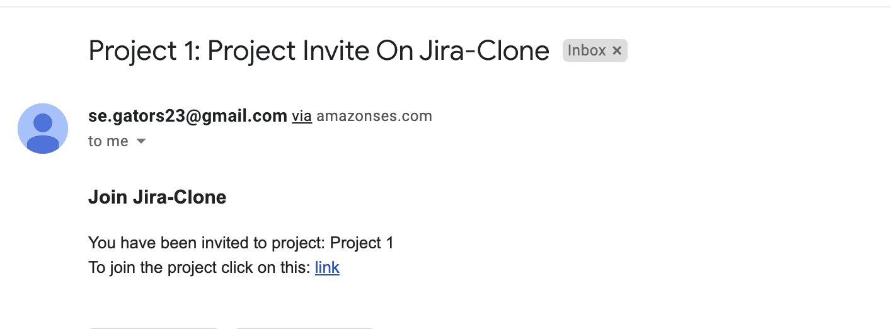

# Sprint 4
**Major Features Implemented**:
- View User Profile
- Update User Profile
- User invite
- Added and updated unit tests for frontend
- Added more cypress test cases for frontend
- Added more backend test cases for all APIs

**User Stories Implemented**:
1. As a user, I should be able view profile in the system.
	* In this user story, the user has the ability to view profile details of self such as email id, first name, last name, username.
2.  As a user, I should be able edit profile in the system.
	* In this user story, the user has the ability to edit profile details of self such as email id, first name, last name, username. 
3. As a user, I should be able to update current password.
	* In this user story, the user has the ability change the passsword by providing old password for verification.
4. As a user, I should be able to invite another user to a project.
	* In this user story, the user has the ability to invite another user to a project which it owns.
5. As a user, I should be able to accept invitation to a project.
	* In this user story, the user has the ability to accept the invitation to a project and then view the details of the project based on role type.
6. As a user, I should be able to view project statistics.
	* In this user story, the user has the ability to view project statistics such as number of comments, number of members present in the project, number of issues present in the project.
7. As a user, I should be able to view project statistics.
	* In this user story, the user has the ability to view project statistics such as number of comments, number of members present in the project, number of issues present in the project.
8. As a user, I should be able to logout from the system.
	* In this user story, the user has the ability to logout from the system and should be unable to view authenticated info unless login credentials are provided again.
9. As a user, I should be able to view comments made by users for an issue.
	* In this user story, the user has the ability to view comments made by users for an issue which belongs to the project the user is part of.
10. As a user, I should be able to add comments to an issue.
	* In this user story, the user has the ability to add comments to an issue which is assigned to a project the user is part of. 
11. As a user, I should be able to change status of issue.
	* In this user story, the user has the ability to change the status of issue which belong to a project the user is part of. 


## User Profile Invitation via Amazon SES:
- Any new user or registered user can be invited to join the project.
- It has been done using AmazonSES.
- Library used for the same is `github.com/aws/aws-sdk-go`.
- The corresponding backend code can be found in file `jira-backend/utils/email_utils.go`

- Here is the sample screenshot of mail sent:</br>    
<kbd>|</kbd>


# Updated Backend APIs Endpoints
- Any request that goes without token gets 401 status code in reply and response as follows:
    ```
    {
    "message": "ACTION_NOT_AUTHORIZED",
    "status": false
    }
    ```
- Any request with expired token gets 400 status code in reply and response as follows:
    ```
    {
    "message": "EXPIRED_TOKEN",
    "status": false
    }
    ```


- **List Members**	  
  *Request Format* -
``` 
    POST /api/project/members
    {
        "project_id": 1,
    }
``` 

&nbsp; &nbsp; &nbsp; &nbsp; &nbsp; &nbsp;*Response Format* -

```    
    {
    "message": "",
    "resp": {
        "members": [
            {
                "user_id": 1,
                "first_name": "Mandar",
                "last_name": "Palkar",
                "user_role": 1
            },
            {
                "user_id": 2,
                "first_name": "Ashish",
                "last_name": "Mhaske",
                "user_role": 2
            }
        ]
    },
    "status": true
}
```  
- **View Project Stats**	  
  *Request Format* -
``` 
    POST /api/project/stats
    {
        "project_id": 1,
    }
``` 

&nbsp; &nbsp; &nbsp; &nbsp; &nbsp; &nbsp;*Response Format* -

```    
    {
        "message": "",
        "resp": {
            "member_count": 2,
            "issue_count": 3,
            "comment_count": 1
        },
        "status": true
    }
```  

- **To Add Comments To An Issue**  
    *Request Format* -
```
    POST /api/comment/add
    {
        "issue_id": 3,
        "comment": "This is a comment for issue_id: 3"
    }

```
&nbsp; &nbsp; &nbsp; &nbsp; &nbsp; &nbsp;*Response Format* -
```
    {
        "message": "",
        "resp": {
            "comment" : "This is a comment for issue_id: 3"
        },
        "status": true
    }
```
<br/>

- **View Comments**  
    *Request Format* -
```
    POST /api/comment/view
    {
        "issue_id": 3
    }

```
&nbsp; &nbsp; &nbsp; &nbsp; &nbsp; &nbsp;*Response Format* -
```
   {
        "message": "",
        "resp": {
            "comments": [
                {
                    "comment_id": 1,
                    "comment": "This is a comment for issue_id: 3"
                }
            ]
        },
        "status": true
    }
```
<br/>


- **View User Profile**  
    *Request Format* -
```
    GET /api/user/info

```
&nbsp; &nbsp; &nbsp; &nbsp; &nbsp; &nbsp;*Response Format* -
```
   {
        "message": "USER_FOUND",
        "resp": {
            "user_id": 0,
            "username": "vaish1",
            "firstname": "v1",
            "lastname": "d1",
            "email_id": "vaish1@mail.com"
        },
        "status": true
    }
```
<br/>

- **Update User Profile**  
    *Request Format* -
```
    PATCH /api/user/info
    {
        "username": "vaish4.",
        "firstname": "v4",
        "lastname": "d4",
        "email_id": "vaish4@mail.com"
    }
    

```
&nbsp; &nbsp; &nbsp; &nbsp; &nbsp; &nbsp;*Response Format* -
```
   {
        "message": "USER_PROFILE_UPDATE_SUCCESS",
        "resp": {
            "user_id": 0,
            "username": "vaish4.",
            "firstname": "v4",
            "lastname": "d4",
            "email_id": "vaish4@mail.com"
        },
        "status": true
    }
```
<br/>


- **Change Password**  
    *Request Format* -
```
    PUT /api/user/change-password
    {
        "old_password": "e807f1fcf82d132f9bb018ca6738a19f",
        "new_password": "e10adc3949ba59abbe56e057f20f883e"
    }
    

```
&nbsp; &nbsp; &nbsp; &nbsp; &nbsp; &nbsp;*Response Format* -
```
   {
        "message": "PASSWORD_CHANGE_SUCCESSFUL",
        "resp": "",
        "status": true
    }
```
<br/>

- **Change Password**  
    *Request Format* -
```
    PUT /api/user/change-password
    {
        "old_password": "e807f1fcf82d132f9bb018ca6738a19f",
        "new_password": "e10adc3949ba59abbe56e057f20f883e"
    }
    

```
&nbsp; &nbsp; &nbsp; &nbsp; &nbsp; &nbsp;*Response Format* -
```
   {
        "message": "PASSWORD_CHANGE_SUCCESSFUL",
        "resp": "",
        "status": true
    }
```
<br/>

- **To Add Comments To An Issue**  
    *Request Format* -
```
    POST /api/comment/add
    {
        "issue_id": 3,
        "comment": "This is a comment for issue_id: 3"
    }

```
&nbsp; &nbsp; &nbsp; &nbsp; &nbsp; &nbsp;*Response Format* -
```
    {
        "message": "",
        "resp": {
            "comment" : "This is a comment for issue_id: 3"
        },
        "status": true
    }
```
<br/>

- **View Comments**  
    *Request Format* -
```
    POST /api/comment/view
    {
        "issue_id": 3
    }

```
&nbsp; &nbsp; &nbsp; &nbsp; &nbsp; &nbsp;*Response Format* -
```
   {
        "message": "",
        "resp": {
            "comments": [
                {
                    "comment_id": 1,
                    "comment": "This is a comment for issue_id: 3"
                }
            ]
        },
        "status": true
    }
```
<br/>

- **Send User Invite**  
    *Request Format* -
```
    POST /api/user/invite
    {
        "email_id":"mandypalkar@gmail.com",
        "project_id": 1
    }

```
&nbsp; &nbsp; &nbsp; &nbsp; &nbsp; &nbsp;*Response Format* -
```
   {
        "message": "INVITATION_SENT",
        "resp": {},
        "status": true
    }
```
<br/>

- **Accept User Invite**  
    *Request Format* -
```
    POST /api/user/verify
    {
        "invite_link":"jwt_encrypted_token"
    }

```
&nbsp; &nbsp; &nbsp; &nbsp; &nbsp; &nbsp;*Response Format* -
```
   {
        "message": "INVITATION_ACCEPTED",
        "resp": {},
        "status": true
    }
```
<br/>

- **To update an issue**  	  
	*Request Format* -
``` 
    POST /api/issue/move
    {
        "issue_id":3,
	"project_id":1,
	"status":2
    }
``` 

&nbsp; &nbsp; &nbsp; &nbsp; &nbsp; &nbsp;*Response Format* -

```    
    {
        "message": "ISSUE_UPDATE_SUCCESS",
        "resp": {},
        "status": true
    }
``` 


## Test Cases:  
Test cases were added for the following 
- Issue related scenarios, 
- User Profile 
- Password Updation
- Email User Invite

